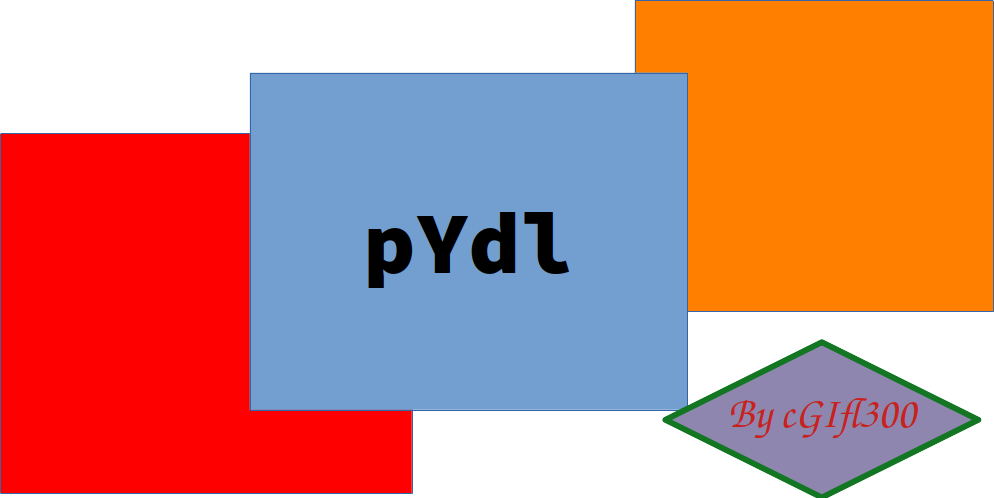

.. pYdl documentation master file, created by
   sphinx-quickstart on Thu Mar 12 18:29:57 2020.
   You can adapt this file completely to your liking, but it should at least
   contain the root `toctree` directive.
   
===================
pYdl documentation!
===================
|logo|

.. toctree::
   :maxdepth: 2
   :caption: Contents:
   
   

Table des matières
==================

* `Project Website`__
* :ref:`genindex`
* :ref:`modindex`
* :ref:`search`

.. _projet: https://pYdl.rtfd.org/
__ projet_
   

